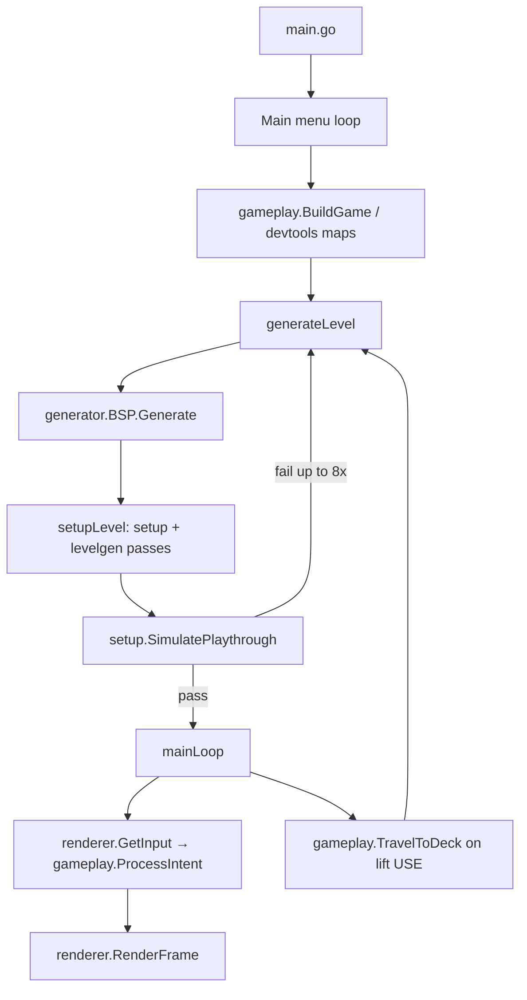

# Agent Notes

This file contains important notes and patterns for AI agents working on this codebase. Read the **Quick start** and **Repository layout** sections first when orienting to the project; use **Common tasks** when you know *what* to change but not *where*.

---

## Quick start

```bash
make              # compile translations + go run .
make build        # binary: ./darkstation
make test         # go test ./...
make codestyle    # go fmt + golangci-lint
make mo           # recompile po/default.pot → mo/en_GB.utf8/... after string changes
```

| Dev flag / env | Effect |
|---|---|
| `-level N` or `LEVEL=N` | Start a new run on deck N (1–10) instead of deck 1 |
| F8 | Dump revealed map + solvability trace to `map.txt` (repo root) |
| F5 | Reset current deck from its seed |
| F9 | Developer menu (seed entry, perf maps, etc.) |

Module: `darkstation` (Go 1.25). Entry point: `main.go`. Renderer: Ebiten v2 (`github.com/hajimehoshi/ebiten/v2`).

User settings persist at `~/.config/DarkStation/settings.ini` (`pkg/game/config`).

---

## Project overview

**The Dark Station** is a single-player, procedurally generated space-station exploration puzzle game written in Go. The player restores power, clears hazards, completes repairs, and travels between **10 decks** via a central lift shaft.

Architectural split:

- **`pkg/engine/`** — reusable grid/FOV/input primitives (no game rules).
- **`pkg/game/`** — all station-specific logic: generation, setup, gameplay, menus, rendering, state.
- **`main.go`** — wires gettext, Ebiten renderer, menu loop, and game loop.

Design authority lives in **`specs/`** (especially `specs/gdd.md` and `specs/power-system.md`). Generated human docs also exist under **`docs/`** (may lag the code).

---

## Repository layout

```
TheDarkStation/
├── main.go                 # Entry: gettext, renderer init, menu ↔ game loop
├── translations.go         # go:embed mo/en_GB.utf8/LC_MESSAGES/default.mo
├── go.mod / Makefile       # Build, test, i18n, codestyle
├── po/default.pot          # gettext source strings
├── mo/en_GB.utf8/...       # Compiled translations (run `make mo` after pot edits)
├── map.txt                 # F8 map dump output (gitignored in normal use; may exist locally)
├── res/fonts/              # Font assets
├── pkg/
│   ├── engine/
│   │   ├── input/          # Tiered input: RawInput → DebouncedInput → Intent
│   │   ├── terminal/       # Terminal abstraction (legacy/auxiliary)
│   │   └── world/          # Grid, Cell, Direction, Item, FOV
│   ├── game/
│   │   ├── config/         # ~/.config/DarkStation/settings.ini (tile size)
│   │   ├── deck/           # 10-deck graph, themes, room naming, observation/linkage cues
│   │   ├── devtools/       # Map dump, dev maps, perf maps, screenshots
│   │   ├── entities/       # Door, Generator, Hazard, Repair, Terminal, Furniture, …
│   │   ├── features/       # Runtime feature toggles (e.g. visited cells via cvar)
│   │   ├── gameplay/       # Input dispatch, movement, interactions, lifecycle, lighting
│   │   ├── generator/      # BSP + LineWalker layout; ship room; lift shaft hub
│   │   ├── levelgen/       # Procedural placement: hazards, furniture, repairs, unlocks, faults
│   │   ├── levelrand/      # Deterministic RNG for all level generation (never math/rand global)
│   │   ├── levelseed/      # Hex seed format/parse for dev menus
│   │   ├── menu/           # Generic menu framework + game/maintenance/lift/inventory UIs
│   │   ├── renderer/       # Renderer interface + shared helpers
│   │   │   └── ebiten/     # Ebiten implementation (drawing, input, menus, callouts)
│   │   ├── setup/            # Post-layout configuration, power grid, solvability, simulation
│   │   ├── state/          # Game, DeckState, run unlocks, messages, completion
│   │   ├── unlocks/        # Run-wide deck travel unlock plan (keycards, routing repairs)
│   │   └── world/          # GameCellData + cell helper predicates (extends engine/world)
│   └── resources/          # Font loading
├── specs/                  # Design specs (GDD, power, faults, lift redesign, …)
├── docs/                   # Generated project documentation
├── .github/workflows/      # CI: build, codestyle
└── _bmad/                  # BMad/GDS workflow tooling (not runtime code)
```

---

## Architecture and runtime flow



**Game loop** (`main.go` → `mainLoop`):

1. Pick up floor items, refresh generator adjacency, update lighting.
2. Refresh on-map hints/callouts.
3. `RenderFrame` (non-blocking path uses `TryGetIntent` on completion screen).
4. Block on `GetInput` → `gameplay.ProcessIntent` (movement, interact, menus, dev keys).
5. Wait out long-use / hazard-clear / hazard-tour cinematics if active.

**Level generation** (`gameplay.generateLevel` → `setupLevel`):

1. Seed `levelrand` from deck seed (retries use `levelrand.NewDerived(seed, attempt)`).
2. `generator.DefaultGenerator` (BSP) builds room topology + lift shaft hub.
3. `setup.SetupLevel` — doors, generators, room power init.
4. `levelgen.*` — hazards, furniture, puzzles, maintenance terminals, repairs, unlock objectives, faults, policies.
5. `setup.Ensure*` passes — reachability, power balance, signage, relays, exit gating.
6. **`setup.SimulatePlaythrough`** acceptance gate; up to 8 attempts (`maxLevelGenAttempts`).

---

## Package reference

### `pkg/engine/world`

Generic 2D grid: `Grid`, `Cell`, `Direction`, `Item`, FOV (`CalculateFOV`, `RevealFOV`). Cells link orthogonally (`North`/`East`/`South`/`West`). Game-specific data hangs off `Cell.GameData` (cast to `gameworld.GameCellData`).

Key APIs: `Grid.GetCell(row, col)`, `Grid.StartCell()`, `Grid.ExitCell()`, `Grid.ForEachCell`.

### `pkg/engine/input`

Four-layer input pipeline:

1. **Raw** — key/button codes from Ebiten (`RawInput`).
2. **Debounced** — repeat suppression (`DebouncedInput`).
3. **Intent** — semantic actions (`Intent{Action, Code}`).
4. Gameplay handlers consume intents.

Important actions (`tiered.go`): movement N/S/E/W; `ActionInteract`; `ActionOpenMenu` / `ActionOpenInventory`; `ActionHint`; dev keys (`ActionDebugMapDump` F8, `ActionResetLevel` F5, `ActionDevMenu` F9); maintenance menu actions (`ActionMaintModeToggle`, circuit presets).

**Primary device** (`primary.go`): keyboard vs gamepad drives on-screen hint strings (`hints.go`: `HintMove()`, `HintInteractPrefix()`, …). Ebiten switches primary on new input and shows a brief notification.

Bindings are user-rebindable (`bindings.go`, settings menu); reserved codes cannot be stolen.

### `pkg/game/world`

`GameCellData` on each cell holds pointers to entities (generator, door, terminals, furniture, hazard, repair device/blocker, power relay) plus lighting/knowledge flags (`LightsOn`, `GridLit`, `Lighted`), signage (`EnvPlaqueMsgID`), linkage tags, pending unlock keycards.

Helper predicates: `HasBlockingHazard`, `HasGenerator`, `RepairDeviceBlocksMovement`, `RepairDeviceBlocksPowerGrid`, etc. — use these instead of reaching into `GameData` ad hoc.

### `pkg/game/state`

Central state: `Game` (active deck + run-wide fields) and `DeckState` (per-deck snapshot in `DeckStates`).

| Field group | Purpose |
|---|---|
| `Grid`, `CurrentCell`, `PlayerFacing` | Active deck layout and player |
| `CurrentDeckID`, `Level`, `DeckStates` | Deck index (0-based ID, 1-based display level) |
| `RunSeed`, `UnlockPlan`, `RunInventory`, `ReactorOnline` | Cross-deck progression |
| `RoomDoorsPowered`, `RoomPowerOnline`, `Policies` | Room power / automation |
| `Generators`, `RepairObjectives`, `Batteries`, `OwnedItems` | Active deck resources |
| `LongUse`, `HazardClear`, `HazardTour` | In-progress interaction cinematics |

Key methods: `SaveCurrentDeckState` / `LoadDeckState`, `InitRunUnlocks`, `IsDeckTravelUnlocked`, `ExitLiftReady` checks via `setup`, repair/generator queries, message/hint management.

Player facing and adjacent-cell cycling: `state/facing.go`, `AdjacentCellsClockwiseFromFacing`.

### `pkg/game/entities`

Entity types (behavior + display metadata):

| File | Types |
|---|---|
| `door.go` | `Door` (keycard-gated room doors) |
| `generator.go` | `Generator`, `NewPermanentFusionReactor` (deck 1 ship) |
| `hazard.go` | `Hazard`, `HazardControl` |
| `furniture.go` | `Furniture`, `FurnitureTemplate`, emergency power conduits |
| `terminal.go` | `CCTVTerminal` |
| `puzzle.go` | `PuzzleTerminal` (codes, linkage tokens) |
| `maintenance.go` | `MaintenanceTerminal` |
| `repair.go` | `RepairObjective`, `RepairType`, blocker cells |
| `routing_coupler.go` | Multi-axis routing minigame params |
| `power_relay.go` | Corridor power routing switches |
| `policy.go` | `ConservationPolicy` (HAB-PRI, ATMOS-SEAL, …) |
| `deck_furniture.go` | Theme-based furniture fallbacks |

### `pkg/game/generator`

- **`BSP`** (`bsp.go`) — default procedural layout; themed room names from `deck`.
- **`LineWalker`** (`line_walker.go`) — alternate generator (not default).
- **`shaft.go`** — centered lift-shaft hub on every deck.
- **`ship.go`** — deck 1 fixed Ship overlay room (west of shaft).
- **`dimensions.go`** — grid sizing per deck.
- Exclusion helpers: `IsEmptyOverlayRoom`, `IsPlacementExcludedRoom`, `ShipRoomName`.

### `pkg/game/levelgen`

Placement passes (called from `gameplay.setupLevel`):

| File | Responsibility |
|---|---|
| `hazards.go` | Environmental hazards + control panels |
| `furniture.go` | Room furniture and hidden items |
| `puzzles.go` | Puzzle terminals |
| `maintenance.go` | Maintenance terminals (incl. shaft bootstrap) |
| `repairs.go` | Repair objectives and blockers |
| `unlocks.go` | Deck unlock objectives (routing couplers, keycards) |
| `faults.go` | Conduit splices, tripped relays |
| `policies.go` | Conservation policies (decks 4+) |
| `exit_gate.go` | Exit-gating repair placement |

All placement that blocks movement must respect `setup.CanPlaceBlockingEntity` (see **Placement invariants**).

### `pkg/game/setup`

Runs **after** layout, **before** play. Largest package (~70 files). Grouped by concern:

| Concern | Key files |
|---|---|
| Core orchestration | `setup.go` |
| Doors / keycards | `doors.go`, `bootstrap_doors.go`, `unlock_keycards.go` |
| Generators / batteries | `generators.go`, `batteries.go`, `generator_bootstrap.go`, `shaft_bootstrap.go`, `ship_bootstrap.go` |
| Room power | `roompower.go`, `room_power_off.go`, `power_propagation.go`, `overlay_room_power.go` |
| Power grid | `power_grid.go`, `power_balance.go`, `power_trace.go`, `relays.go`, `overload.go` |
| Reachability / solvability | `solvability.go`, `solvability_reachability.go`, `exit_reachability.go`, `nav_access.go`, `progression_nav.go`, `region_preservation.go` |
| Blocking placement | `blocking_validator.go`, `CanPlaceBlockingEntity` |
| Exit lift | `exit_lift.go`, `exit_gating_repairs.go` |
| Player entry | `player_entry.go` |
| Simulation gate | `simulate.go` |
| Signage / story cues | `environment.go`, `observation.go`, `linkage.go` |
| Policies (runtime) | `policies.go` |

`CanEnterCellAtInit` mirrors what the sim and init reachability use; gameplay movement uses `gameplay.CanEnter`.

### `pkg/game/gameplay`

Runtime player logic:

| File | Role |
|---|---|
| `lifecycle.go` | `BuildGame`, `generateLevel`, `setupLevel`, `ResetLevel`, deck save/load hooks |
| `input.go` | `ProcessIntent`, dev key handling, menu routing |
| `movement.go` | `CanEnter`, teleport, exit cell rules |
| `interactions.go` | USE/interact cycling on adjacent cells |
| `repairs.go`, `coupler_crank.go` | Repair completion, routing coupler UI flow |
| `lighting.go` | Power-driven lighting + headlamp FOV |
| `travel.go` | `TravelToDeck`, spawn modes (Ship vs lift shaft) |
| `longuse.go`, `hazard_clear.go`, `hazard_tour.go` | Hold-to-complete interactions |
| `door_release.go` | Manual egress release |
| `hints.go` | Tutorial / contextual hints |
| `completion.go` | Run completion sequence |
| `devmenu.go` | F9 developer menu |
| `power_grid_overlay.go` | Maintenance diagnostics overlay state |
| `observation_cue.go`, `linkage_*.go` | Story 5.x environmental beats |

### `pkg/game/menu`

Generic `RunMenu` / `RunMenuDynamic` framework (`menu.go`). Specialized handlers:

- `mainmenu.go` — new game, settings, perf maps, quit
- `gameplay.go` — in-game pause menu
- `maintenance.go`, `maintenance_routing.go`, `power_circuit.go`, `instrument_strata.go` — maintenance terminal UI
- `lift.go` — deck travel list
- `inventory.go` — run-wide inventory overlay
- `routing_coupler.go` — routing coupler minigame panel
- `settings.go`, `bindings.go` — rebinding and tile size

Menus render through `renderer` while blocking on input in the Ebiten update loop.

### `pkg/game/renderer` and `pkg/game/renderer/ebiten`

`renderer.Renderer` interface abstracts drawing and input. Global accessors: `renderer.Init`, `RenderFrame`, `Current.GetInput`, callout helpers, level-gen progress overlay.

Ebiten split across focused files:

| File | Role |
|---|---|
| `ebiten.go` | Window init, hook registration, `RunWithGameLoop` |
| `input.go` / `input_activity.go` | Poll keys/gamepad → Intent channel |
| `rendering.go` | Main `Draw`, status bar, map viewport |
| `cell.go` | Per-cell glyph/tile rendering, knowledge tiers |
| `callouts.go` | Floating interaction hints |
| `menu.go`, `menu_background.go`, `menu_panel_content.go`, `menu_transition.go` | Menu chrome |
| `snapshot.go` | Frame composition |
| `text.go`, `font.go` | Text measurement and drawing |
| `ambient_fx.go` | Subtle background effects |
| `power_grid_overlay.go`, `maint_pan_debug.go` | Diagnostics/debug overlays |
| `build_label.go` | Bottom-right build stamp (`BuildLabel`) |

Knowledge tiers (`cell.go`): `unknown` / `layout` / `remembered` / `live` — only `live` shows full entity state.

### `pkg/game/deck`

- `deck.go` — `TotalDecks = 10`, functional layer types, deck graph, decay params, terminal flavour strings.
- `themes.go` — run-seeded `Theme` assignment and room naming.
- `observation.go`, `linkage.go`, `environment.go` — procedural signage/linkage content.

### `pkg/game/unlocks`

Run-wide lift travel requirements derived from `RunSeed`:

- `plan.go` — generates `Plan` with `Requirement` entries (keycard, routing repair, reactor online).
- `check.go` — `IsDeckTravelUnlocked`, sequential deck progression.
- `thematic.go` — `IsDeckAlwaysReachable` (decks 1–2 at start).

### `pkg/game/levelrand` and `pkg/game/levelseed`

- **All procedural code must use `levelrand`** (`Seed`, `Intn`, `Shuffle`, `NewDerived`) — never the global `math/rand` except `main`'s unrelated seed.
- `levelseed.Format` / `Parse` — uppercase hex seeds for dev UI.

### `pkg/game/devtools`

| File | Purpose |
|---|---|
| `mapdump.go` | F8 → `map.txt` with grid, repairs, simulated playthrough |
| `devmap.go` | Fixed developer test map |
| `maint_pan_test_map.go` | Maintenance pan test layout |
| `perf_maps.go` | Performance scenario maps (menu entry) |
| `screenshot.go` | HTML screenshot export |

### `pkg/game/config` and `pkg/resources`

- Config: tile size in INI; loaded at renderer init.
- Resources: embedded/alternate font paths for Ebiten text rendering.

### `pkg/game/features`

Thin wrappers for renderer-backed cvars (e.g. `VisitedSystemEnabled`).

---

## State model: run vs deck

**Run-wide** (persists across lift travel):

- `RunSeed`, `DeckThemes`, `UnlockPlan`, `UnlockSatisfied`, `LiftRoutingPowered`, `ReactorOnline`
- `RunInventory` — keycards, Map (not consumed on doors)
- `HasMap`

**Per-deck** (stored in `DeckStates[deckID]`):

- Full `Grid`, local `OwnedItems`, `Generators`, `RepairObjectives`, room power maps, policies, manual egress state, `LevelSeed`

**Cross-deck reset on travel** (`clearCrossDeckPowerState`): batteries, local items, generator list, repair list, cinematics — restored from `DeckState` when revisiting.

Deck 1 new-run spawn uses `SpawnModeShip` (Ship room); all other entry uses `SpawnModeLiftShaft` (exit/lift cell).

---

## Power system (code map)

Full spec: `specs/power-system.md`. Implementation spread:

1. **Generation** — generator placement (`setup/generators.go`), conduits (`entities/furniture.go`), relays (`setup/relays.go`), faults (`levelgen/faults.go`).
2. **Propagation** — `setup/power_propagation.go`, `setup/power_grid.go`, `setup.ApplyGridConductivePower`.
3. **Room circuits** — maintenance terminal arms door/CCTV/light circuits (`setup/roompower.go`, menus in `menu/power_circuit.go`).
4. **Consumption / overload** — `setup/power_balance.go`, `setup/overload.go`, policy biasing (`setup/policies.go`).
5. **Diagnostics** — `setup/power_trace.go` (`TraceBusFault` for maintenance terminal).
6. **Exit lift** — requires live power at exit cell + all hazards cleared + all repairs complete (`setup/exit_lift.go`).

Deck 1 **Ship fusion reactor** is always-on (`entities.NewPermanentFusionReactor`); emergency conduits are walkable but conductive.

---

## Testing

Tests are colocated `*_test.go`. Prefer table-driven tests and deterministic seeds.

| Test | Location | Purpose |
|---|---|---|
| `TestGeneratedDecksPassSimulatedPlaythrough` | `gameplay/generation_solvability_test.go` | Seed sweep all decks through sim gate |
| `TestRegenerateFromSeed_Deterministic` | `gameplay/deterministic_test.go` | Layout reproducibility |
| `map.txt` seed tests | various `*_test.go` | Regression against committed `map.txt` seed |
| Package unit tests | `setup/`, `levelgen/`, `entities/`, … | Focused invariant checks |

When changing placement or passability, run at least:

```bash
go test ./pkg/game/gameplay/ -run SimulatedPlaythrough -count=1
go test ./pkg/game/setup/ -count=1
```

Many tests use `levelrand.Seed(fixed)` and `gameplay.SetupLevel(g)` directly without the full Ebiten loop.

---

## Specs and documentation index

| Path | Topic |
|---|---|
| `specs/gdd.md` | Narrative, deck structure, core loop |
| `specs/power-system.md` | Generators, circuits, overload, routing |
| `specs/level-layout-and-solvability.md` | BSP layout, reachability rules |
| `specs/faults-and-diagnosis.md` | Grid faults, bus trace UX |
| `specs/lift-shaft-hub-redesign.md` | Multi-deck lift hub |
| `specs/maintenance-terminal-instrument-strata.md` | Maintenance UI design |
| `specs/power-routing-ux.md` | Power routing player UX |
| `specs/observation-led-puzzle-beat.md` | Environmental investigation |
| `specs/multi-hop-linkage-archetype.md` | Cross-room puzzle linkage |
| `specs/environmental-signage.md` | Diegetic signage |
| `specs/map-tile-focus-and-contrast.md` | Renderer visual design |
| `docs/index.md` | Generated doc index (secondary to specs) |

---

## Common tasks (where to change things)

| Task | Start here |
|---|---|
| New entity type on cells | `entities/`, attach in `gameworld.GameCellData`, render in `renderer/ebiten/cell.go`, interact in `gameplay/interactions.go` |
| New blocker / puzzle mechanic | `setup.CanEnterCellAtInit`, `gameplay.CanEnter`, `setup/simulate.go` simStep, placement via `CanPlaceBlockingEntity` |
| New procedural placement | `levelgen/` new pass + call from `gameplay.setupLevel` |
| New repair type | `entities/repair.go`, `levelgen/repairs.go`, `gameplay/repairs.go`, exit gating in `setup/exit_gating_repairs.go` |
| Deck travel unlock rule | `unlocks/plan.go`, `unlocks/check.go`, placement in `levelgen/unlocks.go` |
| Room power behavior | `setup/roompower.go`, `menu/power_circuit.go`, `gameplay/door_release.go` |
| Maintenance terminal panel | `menu/maintenance*.go`, `renderer/ebiten/menu_panel_content.go` |
| On-screen control hints | `engine/input/hints.go`, `gameplay/hints.go` |
| Player input binding | `engine/input/tiered.go`, `engine/input/bindings.go`, `menu/settings.go` |
| Lift menu / travel | `menu/lift.go`, `gameplay/travel.go` |
| New menu | Implement `menu.MenuHandler`, call `menu.RunMenu` |
| i18n string | Add to `po/default.pot`, run `make mo`, use `gotext.Get("KEY")` |
| Dev/debug tooling | `devtools/`, wire key in `gameplay/input.go` |
| Completion / credits | `gameplay/completion.go`, `state/state.go` completion fields |

---

## Conventions

- **Coordinates:** see **Map coordinates** below — always `x:col y:row` when discussing layout with humans/LLMs.
- **Deck numbering:** `CurrentDeckID` is 0-based; `Level` is 1-based display (`Level = CurrentDeckID + 1`).
- **RNG:** procedural code uses `levelrand` only; retry seeds use `levelrand.NewDerived`.
- **Reachability:** never place blockers against stale candidate lists — validate against the current grid after prior placements in the same pass.
- **Passability trinity:** `setup.CanEnterCellAtInit` ≈ `gameplay.CanEnter` ≈ `simulate.simPassable` must stay aligned.
- **i18n:** user-visible strings go through gotext; embed updates require `make mo`.
- **Renderer markup:** `renderer.StyleText`, `FormatText` for colored in-game log lines.
- **Minimal diffs:** match surrounding package style; don't refactor unrelated code in feature PRs.

---

## Map coordinates

When discussing level layout, hazards, doors, and entities with the player or in debug analysis, use **`x:… y:…`** (horizontal, then vertical):

- **x** = column index (0-based, increases east/right)
- **y** = row index (0-based, increases south/down)

Example: gas at **x:37 y:30** is grid cell `(row=30, col=37)`.

The map dump (`map.txt`, F8) uses the same **`x:… y:…`** format and includes an `llm_coordinate_note` explaining the mapping to `Cell.Row` / `Cell.Col` and `Grid.GetCell(row, col)`.

The bottom-right build stamp uses **`BuildLabel`** (friendly local date/time to the minute, e.g. `28 May 2026, 14:35`). Position with the same bottom-aligned formula as below.

---

## Placement invariants and the solvability gate

Level generation enforces these rules — follow them when adding any new entity, puzzle, or blocker mechanic:

1. **Every permanent blocker placement must pass `setup.CanPlaceBlockingEntity` at placement time** (against the *current* grid, after earlier placements in the same pass — never against a pre-collected candidate list). It enforces:
   - exit reachable at completion (R7),
   - **completion-region preservation** (`setup.CompletionRegionPreserved`): a blocker may never sever any cell reachable under completion passability — this protects rooms behind unpowered doors and corridor pockets that init-reachability checks cannot see,
   - adjacent nav space for interactables, and init keycard/room reachability.
2. **Dependency ordering** (e.g. "the keycard to room A must not be inside room A") is verified globally by **`setup.SimulatePlaythrough`** (`pkg/game/setup/simulate.go`): a greedy fixed-point player that collects items, arms door power, starts generators, completes repairs (honouring `PrereqIDs` and `RequiresPower`), and clears hazards until no progress remains. The deck is accepted only if the exit lift can become ready and every named room is enterable.
3. `generateLevel` runs the simulation as an **acceptance gate** and deterministically regenerates with a derived sub-seed (up to 8 attempts, `g.LevelGenAttempts`) when it fails — seed reproducibility is preserved because retries derive from the level seed.

**Adding a new mechanic:** make it block movement via `setup.CanEnterCellAtInit` + `gameplay.CanEnter` (mirrored in `simPassable`), and add its "requires → grants" step as an action in `simStep` in `pkg/game/setup/simulate.go`. Then it is automatically covered by the placement validator, the acceptance gate, and the seed-sweep test `TestGeneratedDecksPassSimulatedPlaythrough`.

The map dump (`map.txt`, F8) includes a `Repairs:` section, `R`/`~` map symbols for repair devices/blockers, and a `--- Simulated playthrough ---` section showing solvability, failures, and the action trace from the current state.

---

## Text Positioning in Ebiten Renderer

### Bottom-Aligned Text Positioning

When positioning text at the bottom of the screen using `drawColoredText()`, use the following formula:

```go
y := screenHeight - margin - int(textHeight * 2)
```

**Important Notes:**
- `drawColoredText()` uses baseline positioning and internally adds `fontSize` to the Y coordinate
- The formula `textHeight * 2` accounts for:
  1. The baseline offset added by `drawColoredText()` (approximately `fontSize`)
  2. The text height below the baseline (descenders and bounding box)
- Always measure the actual text string using `text.Measure(text, face, 0)` to get accurate `textHeight`
- This formula ensures the bottom of the text (including descenders) aligns with `screenHeight - margin`

**Example:**
```go
_, textHeight := text.Measure(versionText, face, 0)
versionY := screenHeight - margin - int(textHeight * 2)
e.drawColoredText(screen, versionText, versionX, versionY, colorSubtle)
```

**See:** `pkg/game/renderer/ebiten/menu.go` - version text positioning in main menu

---

## Input device hints

The active primary device (`pkg/engine/input`: keyboard vs gamepad) drives on-screen control text via `HintMove()`, `HintInteractPrefix()`, menu helpers in `hints.go`, etc. The Ebiten renderer switches primary on new input from either device, shows a short top-center notification, and refreshes tutorial callouts. Intent polling prefers the primary device first (gamepad-first when controller is active).

---

## Lift travel and deck revisit

The lift shaft is a **centered hub** on every deck. **USE** on the shaft (or exit cell) opens a **lift menu** listing all decks 1–10. The player may **travel bidirectionally** to any **unlocked** deck; locked entries show a disabled reason (missing keycard, routing repair, reactor offline, etc.).

- **Deck 1 start:** a new run spawns in the fixed **Ship** room (west of the lift shaft), connected via a corridor airlock door. **Lift return** to deck 1 still spawns on the **lift exit cell** (same as other decks).
- **Ship fusion reactor:** deck 1 places a permanent **Ship's fusion reactor** two cells below start (always powered, never trips). **Emergency power conduits** (walkable, conductive furniture) link it to the lift-shaft bootstrap generator.
- **Empty overlay rooms:** **Ship** never receives procedural generators, furniture, repairs, hazards, puzzles, items, or policies (`generator.IsPlacementExcludedRoom` / `IsEmptyOverlayRoom`). Lift-shaft bootstrap (generator + maintenance terminal) is unchanged.
- **Start access:** decks 1 (Airlock) and 2 are unlocked at run start.
- **Unlock graph:** seed-procedural requirements (keycards, routing couplers, thematic flags) plus fixed chains (e.g. reactor authorization → deck 5, `ReactorOnline` gates Life Support decks 6–9).
- **Run-wide inventory:** keycards and the Map persist across deck travel; keycards are **not consumed** on doors. Batteries remain **per-deck**.
- **Local lift gating:** `ExitLiftReady` on the current deck still requires local power, hazard clearance, and non-`SkipExitGate` repairs.
- **Completion:** on deck 10, **USE** the lift when `ExitLiftReady` — stepping on the exit cell does **not** auto-advance or complete the run.
- Per-deck state is saved in `DeckStates` so revisiting a deck restores its layout and local progress.

---

## Lighting, knowledge tiers, and grid faults

Lighting is **power-driven** (`pkg/game/gameplay/lighting.go`): a cell is lit when on a live conduit from a powered generator (plus the room's lights toggle for named rooms), or within the player's `HeadlampRadius` line-of-sight. `Lighted` is sticky ("seen lit before"). The renderer classifies cells into **knowledge tiers** (`cellKnowledgeTier`: unknown / layout / remembered / live) — only `live` cells show full entity state; callouts for unseen devices give generic hints, never named solutions.

**Grid faults** interrupt conduction: open `PowerRelay` (tripped breaker) and `RepairConduitSplice` repairs (burned conduit; **walkable**, blocks power not movement — see `RepairDeviceBlocksMovement` / `RepairDeviceBlocksPowerGrid` in `pkg/game/world/cell.go`). Maintenance terminal Diagnostics shows a **bus trace** (`setup.TraceBusFault`) naming the fault class, distance, bearing, and `SEG-xx` label — never exact coordinates. Faults are placed deterministically per seed in `pkg/game/levelgen/faults.go` and gate the exit lift like other repairs. Spec: `specs/faults-and-diagnosis.md`.

**Conservation policies** (decks 4+, `pkg/game/levelgen/policies.go`): deterministic automation rules (`HAB-PRI` shed-first, `ATMOS-SEAL` egress re-seal) readable in maintenance terminal Diagnostics and permanently deprecable with a found **Crew Override Authorization** item. Policies bias the overload shed queue (`sortShedQueue`) and re-seal manual door releases on unpowered rooms — they never make a deck unsolvable and never revert player progress.

**Invariant:** any new entity that blocks movement must go through the blocking-entity engine (`setup.CanPlaceBlockingEntity` / `BlockingPlacementValidator`); entities that only block **power** (like conduit splices) must stay walkable and be completable by the progression simulator (`setup.SimulatePlaythrough`).
